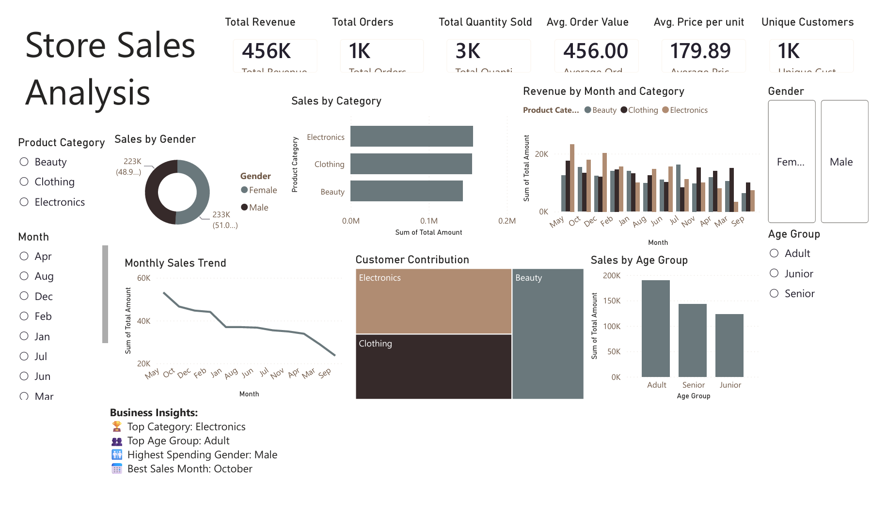

# store_sales_analysis_powerbi
# Store Sales Analysis Dashboard

An interactive Power BI dashboard designed to analyze store sales performance and customer purchasing behavior.

---

## Project Objectives

- Analyze overall sales performance
- Identify top-performing product categories
- Track monthly sales trends
- Understand customer demographics
- Support business decisions using interactive dashboards

---

## Dashboard Preview

---

## Key KPIs

- Total Revenue
- Total Orders
- Total Quantity Sold
- Average Order Value
- Average Price per Unit
- Unique Customers

---

## Dashboard Features

- KPI Cards
- Interactive Slicers
- Monthly Sales Trend
- Sales by Category
- Revenue by Month and Category
- Sales by Age Group
- Gender Analysis
- Customer Contribution
- Business Insights

---

## Tools Used

- Power BI
- Power Query
- DAX
- Excel

---

## Files Included

- Store_Sales_Analysis.pbix
- Store_Sales_Analysis.pptx
- dashboard.png

---

## Business Insights

- Electronics generated the highest revenue.
- Adult customers contributed the highest sales.
- Male customers spent slightly more than female customers.
- October recorded the highest sales.

---

## Author

Devansh Chauhan
